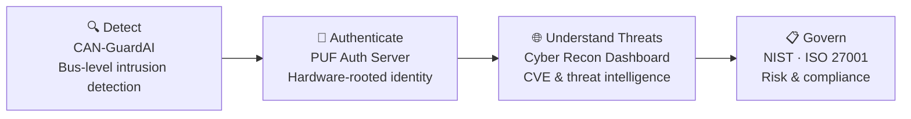

<h1 align="center">Sujay Chawda</h1>

  <b>I study how connected vehicles get attacked, detected, authenticated and governed.</b> 
  Cybersecurity & Forensics student · SDV / Automotive Security · GRC

  
  
  
  

---

## 🧭 What I'm about

Modern vehicles are computers on wheels, and every new software feature adds attack surface. I'm building my career at the point where **security engineering meets governance**: detecting real attacks on in-vehicle networks, and understanding the risk and compliance frameworks that decide whether a vehicle is safe to ship.

I like work that is measurable, explainable and documented, because a security finding nobody can trust or reproduce is not much use.

---

## 🚗 The Connected-Vehicle Security Stack, Through My Projects

| Layer | Project | What it does |
|---|---|---|
| **Detect** | [**CAN-GuardAI**](https://github.com/sujay3806) | ML-based anomaly detection trained on **27M+ real-world CAN bus messages** across multiple attack categories. Random Forest classifier, evaluated on accuracy, precision, recall and F1, with **SHAP explainability** and an interactive Streamlit dashboard. `Python` `Random Forest` `SHAP` `Streamlit` |
| **Authenticate** | [**puf-auth-server**](https://github.com/sujay3806/puf-auth-server) | Authentication server for an ESP32 project exploring **Physical Unclonable Functions (PUF)**, using the hardware's own physical characteristics as device identity. `C++` `ESP32` |
| **Understand threats** | [**cyber-recon-dashboard**](https://github.com/sujay3806/cyber-recon-dashboard) | Threat-intelligence platform pulling **NVD, VirusTotal and AbuseIPDB** into one view: CVE intelligence, IP reputation, malware scanning and security news, served through async FastAPI endpoints. `FastAPI` `React` `Tailwind` |
| **Govern** | Certifications & coursework | ISC2 CC, NIST and ISO 27001 concepts, risk assessment, IT audit fundamentals. |

---

## 🛠️ Toolbox

**Security & GRC:** ISC2 CC · NIST · ISO 27001 (concepts) · Risk Assessment · IT Audit Fundamentals · Access Controls · Root Cause Analysis
**Data & Analytics:** EDA · Feature Engineering · Model Evaluation · Dashboards · Explainable ML

---

## 💼 Experience

**Data Analyst Intern, AiRotor** *(Jul 2026)*
Analyzed drone inspection datasets and built dashboards to support renewable-energy inspection workflows.

---

## 🏅 Credentials

- 🛡️ **ISC2 Certified in Cybersecurity (CC)**
- 🎯 **TryHackMe Pre Security**, Top 8% global ranking
- 💳 **Mastercard Cybersecurity Job Simulation** (Forage)
- 🏆 **Smart India Hackathon** and **HackMIT** participant
- 🎓 **B.Tech CSE (Cybersecurity & Forensics)**, MIT-WPU Pune

---

## 🔭 Currently

- 🔧 Extending **CAN-GuardAI** with deeper explainability and reporting
- 📚 Studying automotive cybersecurity standards (ISO/SAE 21434, UN R155/R156) and how they connect to technical controls
- 🧩 Learning to map technical findings to risk and compliance language

---

## 🤝 Let's Connect

I'm open to internships and entry-level roles in **SDV / automotive security, cybersecurity GRC, and security analytics**.

  
  
  

<!--
OPTIONAL, add later once you have more commits:
Contribution snake: Platane/snk GitHub Action
-->
